# Vue Cli

## 1. 脚手架的安装

​		全局安装即可

```
npm install -g @vue/cli
```

​		查看脚手架版本

```
vue --version
```

## 2. 快速原型开发

​		你可以使用 `vue serve` 和 `vue build` 命令对单个 `*.vue` 文件进行快速原型开发，不过这需要先额外安装一个全局的扩展：

```bash
npm install -g @vue/cli-service-global
```

​		`vue serve` 的缺点就是它需要安装全局依赖，这使得它在不同机器上的一致性不能得到保证。因此这只适用于快速原型开发。


## 3. 创建一个项目

​		在命令行运行以下指令

```
vue create hello-world
```

然后进行一系列配置	

## 4. 使用图形化界面

你也可以通过 `vue ui` 命令以图形化界面创建和管理项目：

```bash
vue ui
```

里面可以看插件，依赖，配置等等

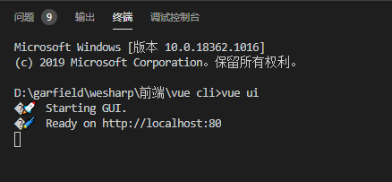


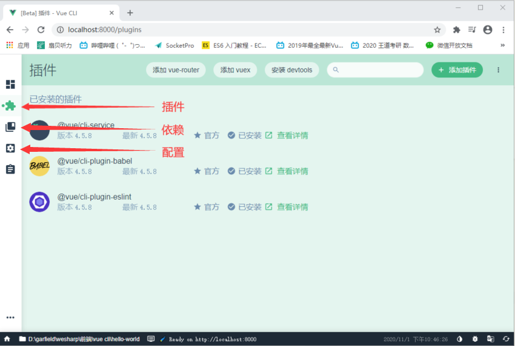


## 5. 运行一个项目

​		通过命令`npm run serve`即可运行项目

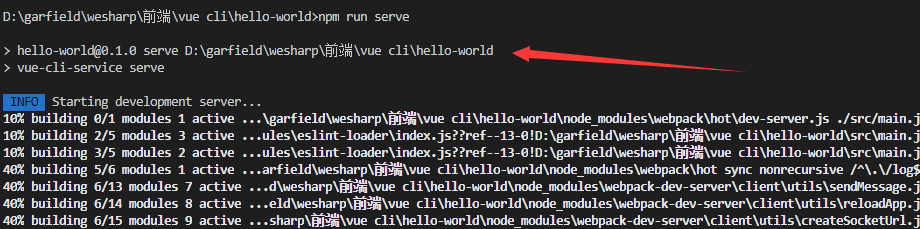

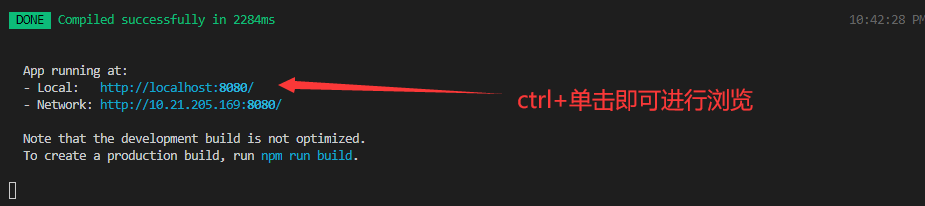


## 6. vue-router

### 6.1 vue-router的安装

​			在终端运行命令`npm install vue router`即可安装

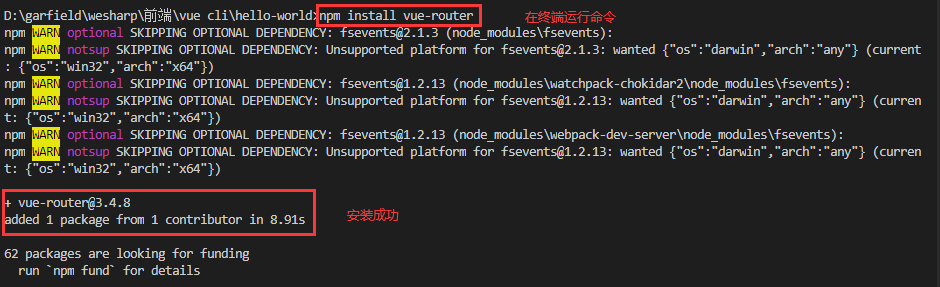


### 6.2 vue-router的使用

  1. #### 在项目中创建router文件夹，在文件夹下面创建index.js

     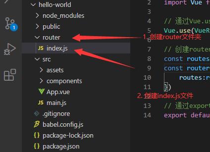

     

  2. #### 在index.js中使用vue-router插件，具体代码如下：

     

     ```js
     import VueRouter from 'vue-router'
     import Vue from 'vue'
     
     // 通过Vue.use()使用插件
     Vue.use(VueRouter);
     
     // 创建router实例
     const routes = [];
     const router = new VueRouter({
         routes:routes
     })
     
     // 通过export导出
     export default router
     ```

  3. #### 在main.js中导入router

     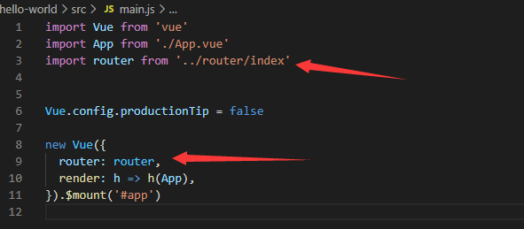

     

  4. #### 配置映射

     

     a. 先创建两个组件

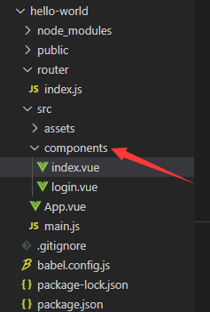

​				b. 在index.js中配置路由映射

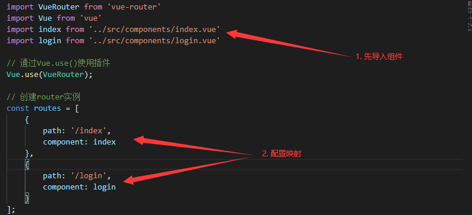

​				c. 将路由写到App.vue中

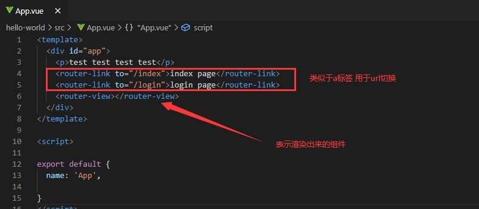

   5. #### 效果展示

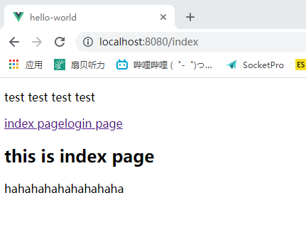

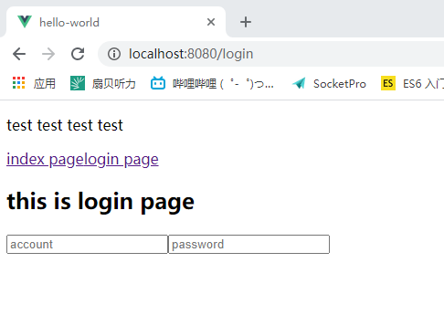


### 6.3 router-link 属性补充

属性1：to									  作用：url的转换

属性2：tag									作用：把router—link标签渲染成其他标签

属性3：replace							 作用：无法返回上一级

属性4：active-class					作用：点击的时候增加active的class


### 6.4 router懒加载


## 7. Promise

```javascript
    new Promise((resolve,reject)=>{
       setTimeout(()=>{
        //  resolve('Look! this is promise');
        //  reject('Request Failed!!!!')
       },1000)
    }).then( res => {
      console.log(res);
      console.log(res);
      console.log(res);
      console.log(res);
      console.log(res);
    }).catch( err =>{
      console.log(err);
      console.log(err);
      console.log(err);
      console.log(err);
    })
```

​		使用方法如上述代码。

​		具体逻辑如下：

​		首先new了一个promise对象，生成promise实例。promise的构造函数接受一个参数作为参数，该函数的两个参数分别是`resolve`和`reject`。

​		`resolve`函数的作用是，将`Promise`对象的状态从“未完成”变为“成功”（即从 pending 变为 resolved），在异步操作成功时调用，并将异步操作的结果，作为参数传递出去；当调用`reslove`函数的时候，会运行`.then`后面的代码，

​		 `reject`函数的作用是，将`Promise`对象的状态从“未完成”变为“失败”（即从 pending 变为 rejected），在异步操作失败时调用，并将异步操作报出的错误，作为参数传递出去。当调用`reject`函数的时候，会运行`.catch`后面的代码，

 


## 8. vuex

### 8.1 什么是vuex

​		根据官方文档说明：Vuex 是一个专为 Vue.js 应用程序开发的**状态管理模式**。它采用集中式存储管理应用的所有组件的状态，并以相应的规则保证状态以一种可预测的方式发生变化。

​		那么什么是状态管理模式呢？简单来说就是当遇到多个组件共享状态时,多层组件的传值非常繁琐,不利于维护,因此把组件的共享状态抽取出来,以一个单例模式管理,这种模式下 不管在哪个组件都可以获取状态或触发行为.


### 8.2 安装

​		运行一下命令即可完成安装

```bash
npm install vuex --save
```

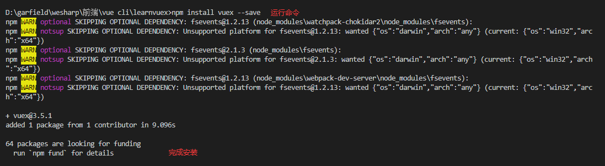


### 8.3 vuex的使用

​		在项目的src文件夹下创建store文件夹，再在store文件夹下创建index.js文件，里面代码如下：

```javascript
import Vue from 'vue'
import Vuex from 'vuex'

// vuex是一个插件 通过Vue.use使用
Vue.use(Vuex)

// 实例化store
const store = new Vuex.Store({
  state:{
    //state里面定义状态量
    count: 999
  },
  mutations:{
    //mutations里面定义方法
    increment (state) {
      state.count++
    },
    decrement (state) {
      state.count--
    }
  },
})

// 导出store
export default store
```

​		在main.js中导入store

```js
import Vue from 'vue'

import App from './App.vue'

import store from './store/index'

Vue.config.productionTip = false


new Vue({

 store: store,

 render: h => h(App),

}).$mount('#app')
```

​		现在有这样一个要求：在两个组件中我都要用到count变量，这时候就可以用vuex进行状态管理。当我们需要改变count的值的时候，我们通过store里面的mutation中定义的方法来改变。那么怎么引用到mutation中的方法呢？我们可以通过`this.$store.commit('方法名')`来使用，talk is cheap， show me the code

​		App.vue:

````vue
<template>
  <div id="app">
      <h2>----------------content in componment1----------------</h2>
      <h2>{{$store.state.count}}</h2>
      <button @click="add">+</button>
      <button @click="sub">-</button>
      <vuex/>
  </div>
</template>

<script>
import vuex from './components/vuex'
export default {
  name: 'App',
  components: {
    vuex
  },

  methods:{
    add(){
      this.$store.commit('increment')
    },
    sub(){
      this.$store.commit('decrement')
    }
  }
}
</script>

<style>

</style>

````

​		vuex.vue:

```vue
<template>
<div>
  <h2>----------------content in componment2----------------</h2>
  <h2>{{$store.state.count}}</h2>
</div>

</template>

<script>
export default {
  name: 'vuex'
}
</script>

<style>

</style>
```

### 8.4 效果展示

通过点击+-使count改变，并且能够通过devtools插件进行跟踪

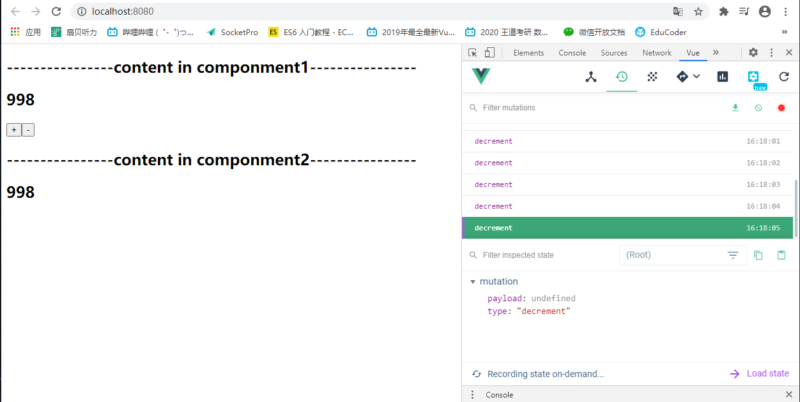


